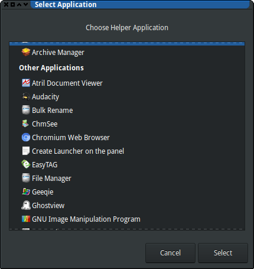

In effort to make things simper, the software developers often reach
quite an opposite goal. One such example I've suddenly stumbled upon
today is GTK *Open With* dialog: adding a custom item there is,
surprisingly, quite a technical task, in a sense that you have to use
google, read the docs and edit some files (with a text editor!). I simply
had to share the details.

## The problem

If you're [anything like me], from time to time you experience an urge
to open a file in `vim`, even from Firefox, or from your point-and-click
file manager. I don't like the GUI versions of `vim`, so I would prefer
to open it in a new terminal window -- something like

```bash
urxvt <other options> -e vim <filename>
```

[anything like me]: https://xkcd.com/1567/

But the best thing you can get from those overly graphical
programs is the GTK *Open With* dialog that allows you (with another dialog)
to select another application:



As I'm not that young and I've seen some things in my time, I can still
remember that there was a button that allowed the user to point to a
custom binary. This was far from perfect --- I would prefer an interface
that would allow to put in a command line --- but it was still something.
Now, no such or similar button is provided; so, I had to dwell into
the mythic realm of *Desktop Files*.

## The mythic realm of Desktop Files

I've always had a strange feeling about all the `freedesktop.org`
standards -- that what they do is very unix-way, and, at the same time,
it's absolutely not.

The *Open With* dialog takes the list of the applications from the
desktop files that should be placed in the specific well-known
locations: either `/usr/share/applications/`,
`/usr/local/share/applications`  or `~/.local/share/applications/`. I've
chosen the latter, since it's always better idea to play with your `$HOME`
then with your `/`.

The [desktop files] are, unsurprisingly, files, in a format that
resembles INI. After some googling and some reading, I came up with
a desktop file that is close to what is claimed to be minimal:

    [Desktop Entry]
    Exec=urxvt -geometry 144x42 -e vim %F
    Type=Application
    Name=ViTerm

[desktop files]: https://standards.freedesktop.org/desktop-entry-spec/desktop-entry-spec-latest.html

I've put these lines into `~/.local/share/applications/viterm.desktop`
file, and it just worked --- no need to refresh or restart anything,
just reopen the application selection dialog.

# Final words

I've put all the relevant words into the introduction of this article.
It's awesome that there is such degree of customizability, and I find
that configuration via text files is quite convenient. It's just a bit
surprising that there is no other way...
