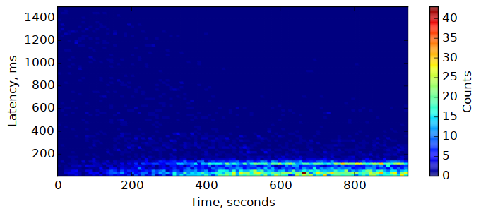
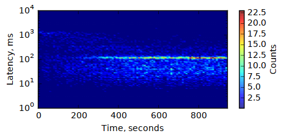
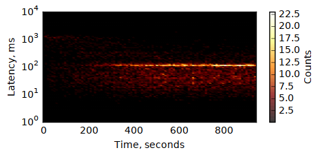
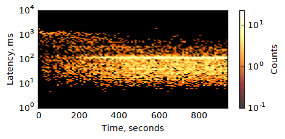
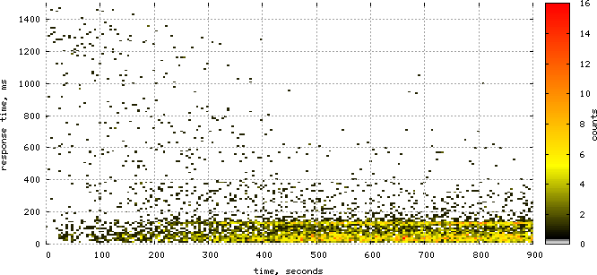

Heatmaps are awesome: in many cases, using color to represent an extra
dimension allows to get good insights on what's really happening. But
how to draw them?  Below, I'll take a quick look onto a couple of ways.

## The Experiment

Currently, I work on a Solr-based search service for one of the US
e-retailers, and of course I'm interested in its performance. I can
easiliy gather the response times from the service -- from various
testbeds, or production -- in form of the application logs, where a
relevant message may look like this:


```
2017-01-01 13:42:33,559 INFO [..skip..] - Client request: /search?keyword=denim%20shirt, response time: 57 ms, found=73, stage=1
```

Let's extract the repsonse times and build some heatmaps! For the
experiment, I'm taking response times for the few minutes after the
application startup, with all the cache warming disabled. This way,
we'll be able to see how response time changes as JVM and Solr caches
are warming.

## trace2heatmap.pl

[Brendan Gregg] once created a very simple, easy to use perl script
to build heat maps from traces gathered with [various tools], most
notably [perf][perf-bg], and made it available
[on github](https://github.com/brendangregg/HeatMap).

[Brendan Gregg]: http://www.brendangregg.com
[various tools]: http://www.brendangregg.com/HeatMaps/latency.html
[perf-bg]: http://www.brendangregg.com/blog/2014-07-01/perf-heat-maps.html

While this tool is usually associated with some hardcore data
sources like `perf` or `iosnoop`, it's in fact quite generic.
The input format is simple: just two space-separated numbers per
line, the timestamp and the latency (or whatever you want to map):

```
$ tail -n 5 ~/tmp/responses.dat
1483264686092 108
1483264686142 48
1483264686182 38
1483264686203 18
1483264686798 592
```

To parse the dates from logs and convert them to unix time, I had to
write some ugly python code I won't dare to show here. In just a couple of
minutes of coding, and dozen more minutes for playing with
`trace2heatmap.pl` parameters, I came up with the following command:

```
$ trace2heatmap.pl --grid --unitstime ms --unitslatency ms \
    --stepsec 5 --rows 100 --maxlat 1500 --boxsize 4 \
    --title 'Search response time -- warmup' \
    ~/tmp/responses.dat > heatmap-warmup.svg
```

It procuced the following SVG:

<object data="heatmap-warmup.svg" type="image/svg+xml"></object>

The cool feature of this heatmap is that it is interactive even in
browser: it shows some metadata for the cell under the mouse pointer
in the status line below the map. For that, the SVG should be
included not as image, but as object:

```html
<object data="heatmap-warmup.svg" type="image/svg+xml"></object>
```

## numpy + matplotlib

[matplotlib] is a python 2D plotting library known in the scientific
community.

[matplotlib]: http://matplotlib.org/

Creating heatmap with it is totally googleable, but the simplest option
--- `plt.hist2d(...)` ---  did not work for me: it displayed the picture
flipped upside down. So, I had to come up with a bit more elaborate
script:

```python
import numpy as np
import matplotlib.pyplot as plt

# read the data
x, y = np.loadtxt('responses.dat', unpack=True)

# change absolute timestamps to relative to start, and convert to seconds:
x = (x - x[0]) / 1000.0

# group the data points
H, xedges, yedges = np.histogram2d(x, y, bins=100)

# draw the histogram
plt.figure(figsize=(8, 3), dpi=600) # figsize -- in inches
plt.pcolormesh(xedges, yedges, H.T, edgecolors='face')
plt.axis((xedges[0], xedges[-1], yedges[0], 1500))

# set the axis labels
plt.xlabel('Time, s')
plt.ylabel('Latency, ms')

# add the colobar
cbar = plt.colorbar()
cbar.ax.set_ylabel('Counts')

# save the image
plt.savefig('plt-heatmap.png', bbox_inches='tight')
```

And, here is the result:



Maybe it's not very impressive but, with certain dedication, time and
help of google (or stackoverflow) it is possible to create really nice
and professionally-looking images. `matplotlib` is very flexible. For
example, it's easy to switch to logarithmic scale for the latency:



You can change the colors -- define your own palette, or use
one of the predefined:



Color scale can be logarithmic, too:



The script used to create the last image is
[here](https://gist.github.com/iv-m/3c9f3187002e4d9ee49175c13fdf1b71).

You can even combine the heatmap with other visualizations (e.g. add a
graph of the average latency on top of the heatmap). Maybe, I did not
try.

There are downsides, too. For one, `matplotlib` + `numpy` are rather
big from dependencies perspective, compared to simple perl script.
Also, the interactive UI is rather slow, and making it to show enough
data for the point under cursor is somewhat tricky.

In fact, everything is kind of tricky. There are just so
may knobs and buttons...

## gnuplot

A few years ago I was using `gnuplot` every day: no other plotting tool
could handle a few thousand data points with that ease and speed. Since
that time 

For heatmaps, `gnuplot` will not prepare the data for you: you need to
define your buckets and transform individual events into the matrix
summary yourself. There are couple of possible formats, shown in
[gnuplot heatmaps demo]. I choose the form `x y count`, with
a newline when `x` changes:

```
2 10 0
2 20 0
2 31 0
[...]
2 2026 0
2 2037 0
2 2047 1

7 10 0
7 20 0
7 31 0
[...]
```

[gnuplot heatmaps demo]: http://gnuplot.sourceforge.net/demo/heatmaps.html

Grouping the data this way with a few simple loops is not that
hard, but I've already used `numpy`, so I used it to make the code
even simpler:


```python
import numpy as np

def tick(array, idx):
    # put tick in the middle of the bucket
    return (array[idx] + array[idx + 1]) / 2

def transform(src_file, dst_file, xbins, ybins):
    # read the data
    x, y = np.loadtxt(src_file, unpack=True)

    # change absolute timestamps to relative to start, and convert to seconds:
    x = (x - x[0]) / 1000.0

    # build the histogram
    H, xedges, yedges = np.histogram2d(x, y, bins=(xbins, ybins))

    # write it
    with open(dst_file, 'w') as f:
        for i in xrange(xbins):
            for j in xrange(ybins):
                f.write('%.0f %.0f %.0f\n' %
                        (tick(xedges, i), tick(yedges, j), H[i, j]))
            f.write('\n')

transform('responses.dat', 'hist2d.dat', 200, 200)
```

Now, it's possible to plot the data with one simple `gnuplot` command:

```gnuplot
plot 'hist2d.dat' with image
```

This will show the interactive window. To save the output to PNG and
make it look a bit nicer, we need a few more commands:

```gnuplot
set term png size 700,320 crop
set output 'gnuplot-heatmap.png'
set xrange [0:900]
set xlabel 'time, seconds'
set yrange [0:1500]
set ylabel 'response time, ms'
set palette defined (0 "white", 1 "black", 13 "yellow", 40 "red")
set cblabel 'counts'
set grid front linetype 0  # 0 means dashed
unset border
plot 'hist2d.dat' with image notitle
```

Just save this to file and run `gnuplot -p heatmap.gnuplot`. Here's the
image:



Gnuplot has pretty much  the same amount of flexibility
`matplotlib` has, and it feels more solid. It's also much faster
--- with 100x100 map it's very noticeable, and `gnuplot` can
easily deal with much larger grids, like 2000x2000.

On other side, there is an additional step of preparing the data,
which makes the whole process more cumbersome. Also, while I find
`gnuplot` easy to use when you've learned it, it always takes a lot of
time to go through the docs and examples and get things going.

Here are couple of `gnuplot`-related links, for future reading:

* Official site -- http://gnuplot.sourceforge.net/
* http://www.gnuplotting.org/
* [Gnuplot tips --- not so Frequently Asked Questions](http://lowrank.net/gnuplot/index-e.html)
* [gnuplot Examples from Neil Carter](http://psy.swansea.ac.uk/staff/carter/gnuplot/)

## Concluding remarks

I've not covered many other options, most notably `R`, which seems
to become *the* tool for data manipulation and analysis, and has
excellent visualization options; but I don't feel like diving there now.

As for the tools covered, `trace2heatmap.pl` is very good for the initial
analysis. If a more beautiful picture is needed, I'd use `gnuplot`;
I hope to find some time and make my data transformation code and
the plotting script more reusable.
