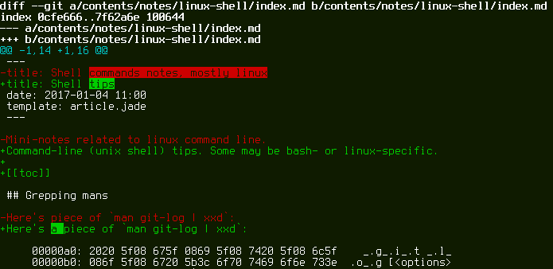

[[toc]]

## Bus factor

http://zgrossbart.github.io/busfactor/


## Useful aliases

```
[alias]
    hist = log --pretty=format:\"%C(auto)%h %ad %s%d [%an]\" --graph --date=short
    root = rev-parse --show-toplevel
```

Basicaly the same as `git hist`, if you're not the machine owner:

```
$ git log --all --oneline --graph --decorate=short
```

## Highlighting differences of changed lines

Git `congrib` directory has a script for that: `diff-highlight`
(`/usr/share/git-core/contrib/diff-highlight/diff-highlight`).
To use it, add the following to your `~/.gitconfig`:

```
[pager]
	log = diff-highlight | less -SR
	show = diff-highlight | less -SR
	diff = diff-highlight | less -SR
```

Result:



Of course, you can always use `git-diff --color-words=.` or something
like that.

## HTTP proxy and self-signed certificates

```
[http]
        sslVerify = true
[http "https://weak.example.com"]
        sslVerify = false
        proxy = proxy.example.com:3128
```

## git grep configuration

```
[color]
	grep = auto
[grep]
	lineNumber = true
[color "grep"]
	filename = magenta
	linenumber = green
	function = yellow
```

## Seldom known commands and features

Mainly because they're seldom needed?

    git clean -fxd
    git config merge.log 9000
    git instaweb
    git notes
    git rerere
    git whatchanged
    git gc --aggressive
